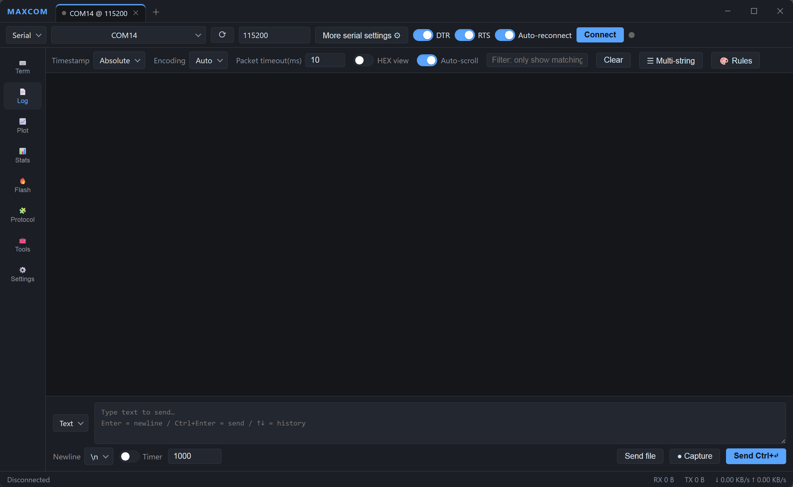

<div align="center">

[**中文**](#chinese) &nbsp;·&nbsp; [**English**](#english)

</div>

<a id="chinese"></a>

# MAXCOM

> 一站式串口 / 网络调试与数据可视化平台

MAXCOM 是一款面向嵌入式与现场调试的跨平台桌面工具，**Rust + Tauri 2** 驱动核心，**TypeScript + Vite + xterm.js + uPlot** 构建界面。它把终端、收发、波形绘图、统计、固件烧录、协议解析和常用工程计算器整合进一个窗口，直接对标 VOFA+、SuperCom、SSCOM、SerialPlot、SecureCRT 等工具的常见痛点。


## ✨ 功能

- **⌨️ 终端（Terminal）** — 交互式终端，基于 xterm.js 的 ANSI 解析渲染，击键直传。
- **📄 收发（Log View）** — 传统串口助手：时间戳（三格式）、自动染色、行过滤、HEX 显示、自动滚动、智能分包。
- **📈 绘图（Plot）** — uPlot 驱动的实时波形，支持 Simple Binary / ASCII 解析。
- **📊 统计（Stats）** — RX / TX / 速率与通道指标仪表盘。
- **🔥 烧录（Flash）** — 探针 + 芯片的固件烧录（.elf / .hex / .bin / .uf2），可选烧录后校验 / 复位、烧录并打开 RTT。
- **🧩 协议（Protocol）** — 插件式协议面板，当前内置 **Modbus RTU**（CAN 等可通过协议注册表扩展）。
- **🧰 工具（Tools）** — 40+ 内嵌工程计算器（带手绘电路图、可点击的二进制码盘、KaTeX 公式渲染）：
  - 电路：555 定时器 / 衰减器（Pi / 桥T / 反射式 / T 型）/ 欧姆定律 / LED 限流 / 分压 / 分流 / RC 时间常数 / 电抗 / 滤波器 / 三相功率
  - 元器件：电阻色码 / 三位与 EIA-96 SMD 电阻 / SMD 电容 / 电容换算 / 串并联电阻电容 / 热敏电阻 NTC
  - 高频 PCB：走线阻抗 / 印制线宽度（IPC-2221）/ 频率波长 / 线径 AWG
  - 单位换算：长度 / 重量 / 体积 / 温度 / 压力 / 能量 / 功率 / 力 / 电感
- **🌐 双语界面** — 中 / 英界面语言切换，设置即时生效并持久化。
- **🎨 多主题** — 跟随系统、浅色、深色、彩色，以及 Midnight / Solarized / OLED/ Nord / Dracula 等预设。

## 🖥 连接方式

串口、TCP 客户端、UDP 客户端（更多协议持续接入中），支持 DTR / RTS / 自动重连等常用控制。

## 🧱 技术栈

| 层 | 技术 |
|---|---|
| 桌面外壳 | Tauri 2（Rust） |
| 核心引擎 | Rust 工作区（`maxcom-core` 纯逻辑 + `maxcom-engine` 传输层） |
| 前端 | TypeScript + Vite 8（严格模式） |
| 终端 | xterm.js |
| 波形 | uPlot |
| 公式渲染 | KaTeX |

分层铁律：**core 不依赖 engine，engine 不依赖 tauri**。业务逻辑全部位于 Rust 纯逻辑核心（全量单测），前端薄胶水只做参数搬运与渲染。

## 🚀 开发 / 构建

```bash
# 核心引擎测试（无系统依赖）
cargo test --workspace

# 前端
cd app
npm install
npm run dev          # 浏览器演示模式（自动注入模拟后端），http://localhost:1420
npm run build        # 选择器校验 + tsc + vite + 冒烟 + 纯逻辑/DOM 回归测试

# 桌面（Windows 推荐目标平台；Linux 需 webkit2gtk-4.1 开发包）
npm run tauri dev
npm run tauri build  # NSIS 安装包
```

## 📁 项目结构

```
FXX-MAXCOM/
├── crates/
│   ├── maxcom-core/      # 纯逻辑引擎（编码/分包/过滤/统计/绘图解析），全量单测
│   └── maxcom-engine/    # 传输层（串口/TCP/UDP）+ 会话线程编排
├── app/
│   ├── src/              # 前端 TypeScript（Vite；xterm.js 终端，uPlot 波形）
│   ├── src/pages/        # 终端 / 收发 / 绘图 / 统计 / 烧录 / 协议 / 工具 / 设置
│   ├── src-tauri/        # Tauri 薄胶水（commands / events）
│   └── scripts/          # 构建期回归测试（选择器/冒烟/plot/modbus/tools/DOM）
├── documents/            # 设计与决策单一事实源（契约 / ADR / SPEC，CI 可校验）
├── AGENT.md              # 面向开发者/AI 的架构与分层说明（原 README）
└── screenshoots/         # 界面截图
```

## 📄 许可

[MIT](LICENSE) © [fangxx3863](https://github.com/fangxx3863)

## 🌟 参与开源

本项目已开源至 [github.com/fangxx3863/FXX-MAXCOM](https://github.com/fangxx3863/FXX-MAXCOM)。欢迎 **Star**、提 **Issue**、提交 **PR**，一起共建一个顺手、开源、可扩展的调试工具。

---

<a id="english"></a>

# MAXCOM

> One-stop serial / network debugging and data visualization platform

MAXCOM is a cross-platform desktop tool for embedded and field debugging, with a **Rust + Tauri 2** core and a **TypeScript + Vite + xterm.js + uPlot** frontend. It brings terminal, send/receive, waveform plotting, stats, firmware flashing, protocol parsing and common engineering calculators together in one window, taking aim at the recurring pain points of tools like VOFA+, SuperCom, SSCOM, SerialPlot and SecureCRT.



## ✨ Features

- **⌨️ Terminal** — interactive terminal with xterm.js ANSI parsing/rendering and direct keystroke passthrough.
- **📄 Log View** — classic serial assistant: timestamps (three formats), auto-coloring, line filtering, HEX display, auto-scroll, smart packet framing.
- **📈 Plot** — uPlot-driven real-time waveform, supports Simple Binary / ASCII parsing.
- **📊 Stats** — RX / TX / rate and channel-metric dashboard.
- **🔥 Flash** — probe + chip firmware flashing (.elf / .hex / .bin / .uf2), optional verify / reset after flashing, and flash-and-open RTT.
- **🧩 Protocol** — plugin-based protocol panel; currently ships with **Modbus RTU** (CAN and others extensible via the protocol registry).
- **🧰 Tools** — 40+ embedded engineering calculators (hand-drawn circuit diagrams, clickable binary code wheels, KaTeX formula rendering):
  - Circuit: 555 timer / attenuator (Pi / Bridged-T / Reflex / T) / Ohm's law / LED current limit / voltage divider / current divider / RC time constant / reactance / filter / three-phase power
  - Components: resistor color code / 3-digit and EIA-96 SMD resistors / SMD capacitors / capacitor conversion / series-parallel R-C / NTC thermistor
  - High-frequency PCB: trace impedance / conductor width (IPC-2221) / frequency-wavelength / wire gauge AWG
  - Unit conversion: length / weight / volume / temperature / pressure / energy / power / force / inductance
- **🌐 Bilingual UI** — Chinese / English interface language toggle that applies instantly and persists.
- **🎨 Multiple themes** — follow system, light, dark, colorful, plus Midnight / Solarized / OLED / Nord / Dracula presets.

## 🖥 Connections

Serial, TCP client and UDP client (more protocols continually added), with common controls like DTR / RTS / auto-reconnect.

## 🧱 Tech stack

| Layer | Technology |
|---|---|
| Desktop shell | Tauri 2 (Rust) |
| Core engine | Rust workspace (`maxcom-core` pure logic + `maxcom-engine` transport layer) |
| Frontend | TypeScript + Vite 8 (strict mode) |
| Terminal | xterm.js |
| Waveform | uPlot |
| Formula rendering | KaTeX |

Hard layering rule: **core must not depend on engine; engine must not depend on tauri**. All business logic lives in the Rust pure-logic core (fully unit-tested); the frontend is thin glue that only passes parameters and renders.

## 🚀 Development / Build

```bash
# Core engine tests (no system dependencies)
cargo test --workspace

# Frontend
cd app
npm install
npm run dev          # browser demo mode (auto-injects a mock backend), http://localhost:1420
npm run build        # selector validation + tsc + vite + smoke + pure-logic/DOM regression tests

# Desktop (Windows recommended target; Linux requires webkit2gtk-4.1 dev package)
npm run tauri dev
npm run tauri build  # NSIS installer
```

## 📁 Project structure

```
FXX-MAXCOM/
├── crates/
│   ├── maxcom-core/      # pure logic engine (encoding/framing/filtering/stats/plot parsing), fully unit-tested
│   └── maxcom-engine/    # transport layer (serial/TCP/UDP) + session thread orchestration
├── app/
│   ├── src/              # frontend TypeScript (Vite; xterm.js terminal, uPlot waveform)
│   ├── src/pages/        # terminal / log view / plot / stats / flash / protocol / tools / settings
│   ├── src-tauri/        # Tauri thin glue (commands / events)
│   └── scripts/          # build-time regression tests (selectors/smoke/plot/modbus/tools/DOM)
├── documents/            # single source of truth for design & decisions (contracts / ADR / SPEC, CI-validated)
├── AGENT.md              # architecture & layering guide for developers/AI (former README)
└── screenshoots/         # UI screenshots
```

## 📄 License

[MIT](LICENSE) © [fangxx3863](https://github.com/fangxx3863)

## 🌟 Contributing

This project is open source at [github.com/fangxx3863/FXX-MAXCOM](https://github.com/fangxx3863/FXX-MAXCOM). We welcome **Stars**, **Issues** and **PRs** — let's build a handy, open, extensible debugging tool together.
