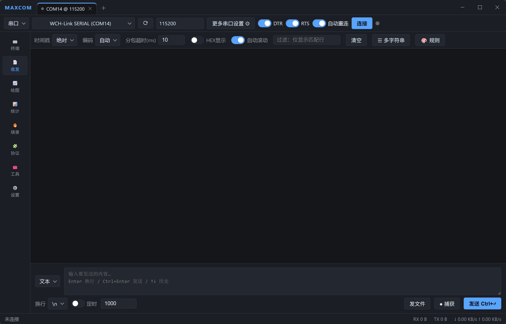

# MAXCOM

> 一站式串口 / 网络调试与数据可视化平台

MAXCOM 是一款面向嵌入式与现场调试的跨平台桌面工具，**Rust + Tauri 2** 驱动核心，**TypeScript + Vite + xterm.js + uPlot** 构建界面。它把终端、收发、波形绘图、统计、固件烧录、协议解析和常用工程计算器整合进一个窗口，直接对标 VOFA+、SuperCom、SSCOM、SerialPlot、SecureCRT 等工具的常见痛点。



## ✨ 功能

- **⌨️ 终端（Terminal）** — 交互式终端，基于 xterm.js 的 ANSI 解析渲染，击键直传。
- **📄 收发（Log View）** — 传统串口助手：时间戳（三格式）、自动染色、行过滤、HEX 显示、自动滚动、智能分包。
- **📈 绘图（Plot）** — uPlot 驱动的实时波形，支持 Simple Binary / ASCII 解析。
- **📊 统计（Stats）** — RX / TX / 速率与通道指标仪表盘。
- **🔥 烧录（Flash）** — 探针 + 芯片的固件烧录（.elf / .hex / .bin / .uf2），可选烧录后校验 / 复位、烧录并打开 RTT。
- **🧩 协议（Protocol）** — 插件式协议面板，当前内置 **Modbus RTU**（CAN 等可通过协议注册表扩展）。
- **🧰 工具（Tools）** — 40+ 内嵌工程计算器（带手绘电路图、可点击的二进制码盘、KaTeX 公式渲染）：
  - 电路：555 定时器 / 衰减器（Pi / 桥T / 反射式 / T 型）/ 欧姆定律 / LED 限流 / 分压 / 分流 / RC 时间常数 / 电抗 / 滤波器 / 三相功率
  - 元器件：电阻色码 / 三位与 EIA-96 SMD 电阻 / SMD 电容 / 电容换算 / 串并联电阻电容 / 热敏电阻 NTC
  - 高频 PCB：走线阻抗 / 印制线宽度（IPC-2221）/ 频率波长 / 线径 AWG
  - 单位换算：长度 / 重量 / 体积 / 温度 / 压力 / 能量 / 功率 / 力 / 电感
- **🌐 双语界面** — 中 / 英界面语言切换，设置即时生效并持久化。
- **🎨 多主题** — 跟随系统、浅色、深色、彩色，以及 Midnight / Solarized / OLED/ Nord / Dracula 等预设。

## 🖥 连接方式

串口、TCP 客户端、UDP 客户端（更多协议持续接入中），支持 DTR / RTS / 自动重连等常用控制。

## 🧱 技术栈

| 层 | 技术 |
|---|---|
| 桌面外壳 | Tauri 2（Rust） |
| 核心引擎 | Rust 工作区（`maxcom-core` 纯逻辑 + `maxcom-engine` 传输层） |
| 前端 | TypeScript + Vite 8（严格模式） |
| 终端 | xterm.js |
| 波形 | uPlot |
| 公式渲染 | KaTeX |

分层铁律：**core 不依赖 engine，engine 不依赖 tauri**。业务逻辑全部位于 Rust 纯逻辑核心（全量单测），前端薄胶水只做参数搬运与渲染。

## 🚀 开发 / 构建

```bash
# 核心引擎测试（无系统依赖）
cargo test --workspace

# 前端
cd app
npm install
npm run dev          # 浏览器演示模式（自动注入模拟后端），http://localhost:1420
npm run build        # 选择器校验 + tsc + vite + 冒烟 + 纯逻辑/DOM 回归测试

# 桌面（Windows 推荐目标平台；Linux 需 webkit2gtk-4.1 开发包）
npm run tauri dev
npm run tauri build  # NSIS 安装包
```

## 📁 项目结构

```
FXX-MAXCOM/
├── crates/
│   ├── maxcom-core/      # 纯逻辑引擎（编码/分包/过滤/统计/绘图解析），全量单测
│   └── maxcom-engine/    # 传输层（串口/TCP/UDP）+ 会话线程编排
├── app/
│   ├── src/              # 前端 TypeScript（Vite；xterm.js 终端，uPlot 波形）
│   ├── src/pages/        # 终端 / 收发 / 绘图 / 统计 / 烧录 / 协议 / 工具 / 设置
│   ├── src-tauri/        # Tauri 薄胶水（commands / events）
│   └── scripts/          # 构建期回归测试（选择器/冒烟/plot/modbus/tools/DOM）
├── documents/            # 设计与决策单一事实源（契约 / ADR / SPEC，CI 可校验）
├── AGENT.md              # 面向开发者/AI 的架构与分层说明（原 README）
└── screenshoots/         # 界面截图
```

## 📄 许可

[MIT](LICENSE) © [fangxx3863](https://github.com/fangxx3863)

## 🌟 参与开源

本项目已开源至 [github.com/fangxx3863/FXX-MAXCOM](https://github.com/fangxx3863/FXX-MAXCOM)。欢迎 **Star**、提 **Issue**、提交 **PR**，一起共建一个顺手、开源、可扩展的调试工具。
